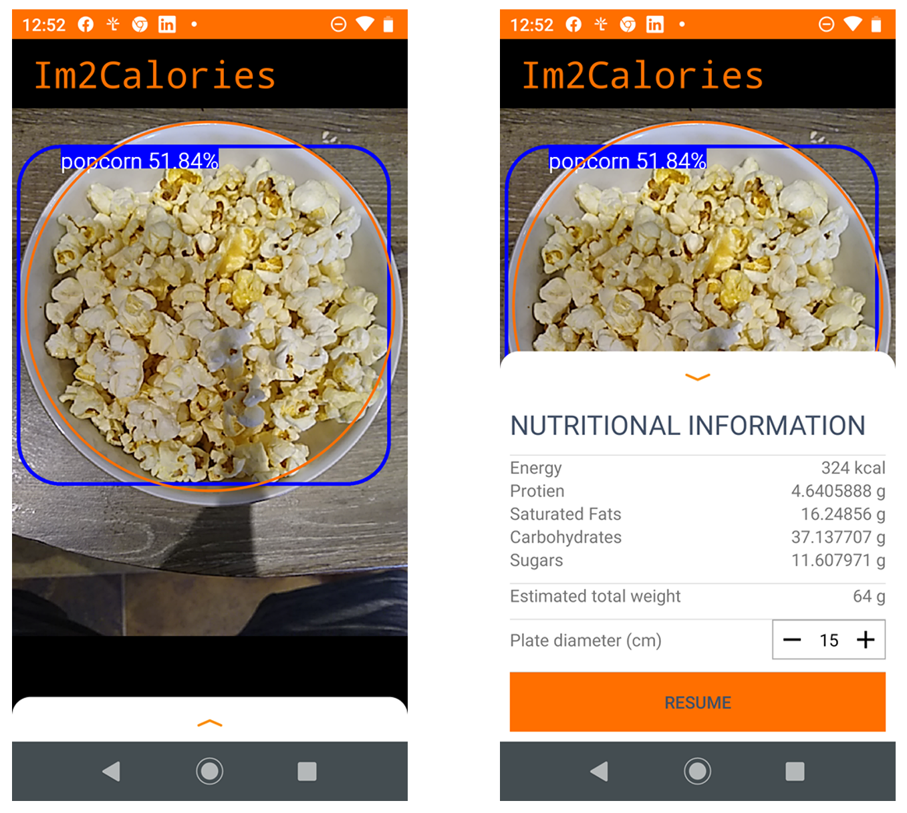

# Img2Calories
Can a mobile phone app accurately predict the nutritional contents of a meal from a single image?

## Description
This project aims to overcome the barriers of current food journal applications by automating the data entry process using just a single image. The proposed solution is required to recognise foods present in the image using modern computer vision techniques and subsequently infer the total nutritional contents. Furthermore, the accuracy of the nutritional information can be improved by differentiating portion sizes of foods, all fully embedded into a mobile phone application.

## System Overview
Food components are localised within the image either by semantic segmentation or an ellipses approximation within a bounding box. The localised area and the depth obtained from a depth map or average food depth is mapped to a volume, giving a portion weight from which the nutritional contents is inferred.

## Content
* application - Mobile phone application built from Android Studio that runs the food detection on-device using Tensorflow Lite.

* databases - Nutritional database for the 256 classes within Food256 (inc. food densities and average depth).

* evaluation - Results from a evaluation study undertook on the proposed mobile application including sample images.

* notebooks - Jupyter Notebooks which include training, evaluation and inference scripts that can deployed on Cloud platforms.

* raw - Contains an annotating application written in Python for retrieving and labelling images with bounding boxes.

* utilities - training and evaluation modules for object detection provided by PyTorch.

## Acknowledgments
Template for the mobile application was taken from https://github.com/tensorflow/examples/tree/master/lite/examples/object_detection/android.

PyTorch object detection tutorial providing training and evaluation modules is available from https://pytorch.org/tutorials/intermediate/torchvision_tutorial.html.
